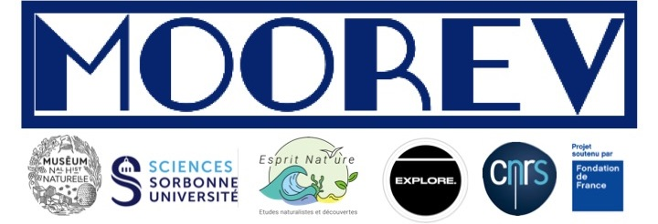

## Project MOOREV: Annotation and Analysis of Underwater Species Images and Videos


## 🎯 *Project Objective*
1. **Image and Video Annotation:** Annotation methods for images using the [VIAME](https://github.com/VIAME/VIAME?tab=readme-ov-file) tool, providing image and video annotation for various users such as researchers, students, teachers, educational facilitators, and volunteers. The web platform is accessible at [viame.kitware.com](https://viame.kitware.com/#/).

2. **Species Recognition through Machine Learning:** Recognition of target species using AI techniques by training models for recognition, segmentation, and tracking with [Ultralytics](https://www.ultralytics.com/fr/) [YOLOv8](https://github.com/ultralytics/ultralytics).

3. **Quantification of Morphological and Behavioral Characteristics:** Investigation of the quantification of individual morphological characteristics (size, shape, and color) and behavior using tools from the [OpenCV](https://opencv.org/) library in Python.

4. **Access to Tools:** All tools are accessible on the [Galaxy-Ecology Europe](https://usegalaxy.eu/) portal to make these image annotation and analysis methods available to online users.

## 🤝 *Authors*
- Islem KOBBI
- Lynda FEDDAK
- Shivamshan SIVANESAN
- Sofiane OUALI

## 📚 *Project Structure*

- **/[`Galaxy Dev`](https://github.com/SShivamshan/Projet_MOOREV/tree/main/Galaxy%20Dev) :** This directory contains XML scripts for launching tools for the annotation and analysis of underwater species images and videos from the Galaxy platform.

- **/[`docker`](https://github.com/SShivamshan/Projet_MOOREV/tree/main/docker) :** This directory includes the file [`moorev_dev.Dockerfile`](https://github.com/SShivamshan/Projet_MOOREV/blob/main/docker/moorev_dev.Dockerfile) for creating the VIAME installation with all its dependencies, as well as another [`moorev_prod.Dockerfile`](https://github.com/SShivamshan/Projet_MOOREV/blob/main/docker/moorev_prod.Dockerfile) for using this Docker image as a base, which will be used for production.
- **/[`docs`] : The directory contains the project documentation
- **/[`models`] : The directory contains the trained YOLOv8 models (.pt files)
- **/[`pipelines`](https://github.com/SShivamshan/Projet_MOOREV/tree/main/pipelines) :** This directory contains the necessary files for creating a pipeline
 .pt files for models trained with YOLOv8.
- **`/results` :** Storage of results obtained from analyses and experiments.

## 🛠 *Requirements*

Pip install [`requirements`](https://github.com/SShivamshan/Projet_MOOREV/blob/main/requirements.txt) in a Python>=3.8 environment with PyTorch>=1.8.

```bash
pip install --upgrade -r requirements.txt
```

## 💡 *How to Contribute*

1. Clone the repository locally: `git clone https://`[`github.com/your-username/repo-name`](https://github.com/SShivamshan/Projet_MOOREV)`.git`
2. Create your feature branch: `git checkout -b your-feature-name`
3. Make your changes and commit: `git commit -m "Added feature X"`
4. Push your changes to the branch: `git push origin your-feature-name`
5. Create a Pull Request to discuss the changes made.

We encourage any contributions, whether they be bug reports, new features, or improvements to the documentation.

## 🚀 *Run*
```bash
python main.py
```

## ⌛ *Results*
### *Annotation on [VIAME](https://viame.kitware.com/#/)*


### *Launch tools on [Galaxy-Ecology Europe](https://usegalaxy.eu/)*

